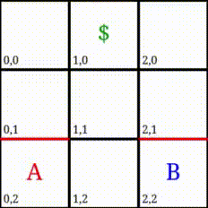

# Multiagent Reinforcement Learning in Stochastic Games

This repository contains the implementation and visualization of a Reinforcement Learning Framework described in the paper ["Multiagent Reinforcement Learning in Stochastic Games" by Junling Hu and Michael P. Wellman](paper.pdf) for the Paris-Sud FIIL M2 program.


<p align="center">
  
</p>

## Authors

Lucas LUGAO <@lucaslugao>  
Victor VIANNA <@victorvianna>  

## How to run


To build the docker image please run the following bash script:

```shell
$ > ./scripts/build.sh
```

Once the image is built run it with


```shell
$ > ./scripts/run.sh
```

## Presentation slides
A presentation covering the background, motivation and proof overview for the paper can be found [here](slides.pdf).
